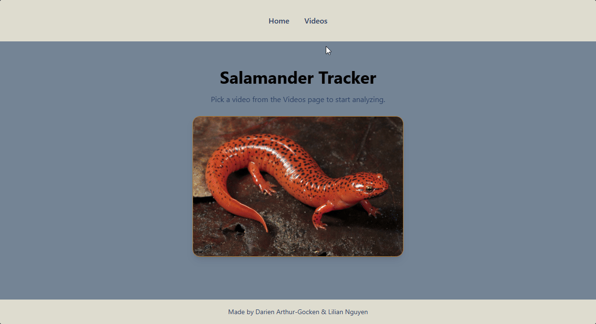

# Salamander Tracker 

## Created by: 
Darien Arthur-Gocken & Lilian Nguyen

## Project Overview:
Salamander Tracker is a full-stack web application that allows users to analyze salamander videos by selecting a target color and tolerance threshold. The application generates a binary image preview showing detected regions and exports centroid tracking data as a CSV file for further analysis. 

Users can: 
- Browse available salamander videos
- Preview a video frame before processing
- Select a target color using a color picker
- Adjust the color tolerance threshold
- View a binary image representation of the detected regions
- Display the centroid of the largest detected region
- Export tracking results as a CSV file
- View the most recently genereated CSV results using the latest button

## Prerequisites: 
- Java 21
- Maven
- Node.js
- npm

## Environment Variables
Create a `.env` file by copying the `.env.example` file & modify any values that needs to be changed.

## Processor Setup (Java Backend)
The processor is responsible for analyzing video frames and generating centroid tracking CSV files.

### Build the Processor
- Navigate to the processor directory: `cd processor`
- Build the project: `mvn clean package`
- It will then generate the jar file

### Server Setup
- Navigate to the server directory: `cd server`
- Install dependencies: `npm install`
- Start the backend server: `npm run dev`
- The back will be available at: `http://localhost:3000`

## Frontend Setup
- Install dependencies: `npm install`
- Start the development server: `npm run dev`
- The frontend will be available at: `http://localhost:5173`

## Color Palette
- Text #2B4064
- Background #748496
- Primary #77B248
- Secondary #DEDCFF
- Accent #B27729

## Custom Feature
### Latest Results Button
The latest button on the videos page allow users to quickly access the most recently generated CSV file. 

How to Use:
1. Navigate to the videos page.
2. Locate the desired video in the list.
3. Click the latest button.
4. The application will display the most recently generated centroid tracking results for that video. 

## Demonstration 

### Links to Repository:
- Frontend: https://github.com/DarienArthur-Gocken/salamander
- Backend: https://github.com/DarienArthur-Gocken/centroid-finder